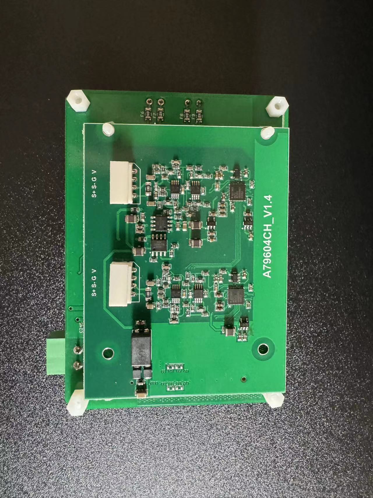

##

Ultra low power consumption,super long time last,stand alone with huge battery built in mini IOT device.

With 4G and NB-IOT, Wifi and Bluetooth, easy configuration for all kinds of situation.

Built-in high and low temperature resistant large battery.

Large SRAM and SD card for data storage and convenient IoT configuration.

Built-in vibration sensor, parameters: 1200HZ 1MHZ.

Built-in temperature and humidity sensor.

Built-in gas sensor.

#  'Image credit: [**Unsplash**](https://unsplash.com)'

